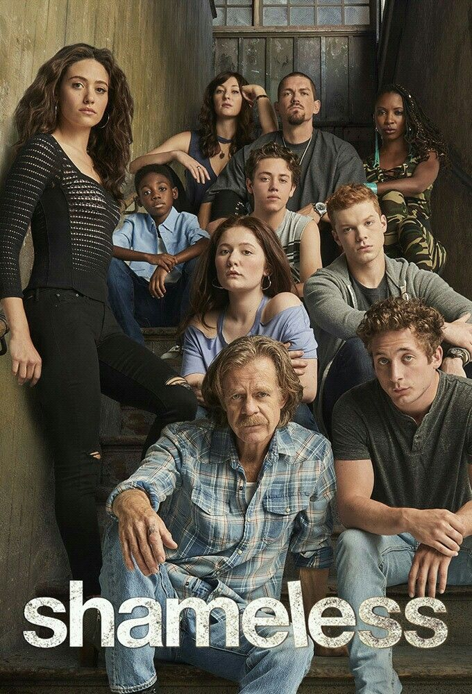

<h1>MY ALL TIME FAVOURITE  MOVIES/SERIES</h1>
<h2>{movies are arrange on thier year of release respectively}
</h2>
<ol>
    <li><h2>AMERICAN HUSTLE (2004)</h2></li>
    <h2> (DIRECTED BY DAVID O.RUSSEL, AMERICAN HUSTLE POTRAIT 90S VINTAGE. STORY REVOLVES BANK FROUD AND A MEXICAN CARTEL AND AN AVERAGE AMERICAN MIDDLE CLASS STRUGGLNG TO SURVIVE IN A DISTOPIENT CIVIL WAR ERA.) </h2>
    
    <li><h2>GAMES OF THRONES (2011)</h2></li>
    <h2>(ALL TIME ICONIC  GAMES OF THRONES BY GEORGE RR MARTIN, IS AN ABSOLUTE MASTERPIECE. PREMISES OF SERIES REVOLVES AROUND 4 POWERFULL HOUSES AND THERE STUGGLE TO SIT ON IRON THRONE)</h2>
    
   <li><h2>CHANGELING (2009) </h2></li>
   <h2>(YOUNG MOTHER IN LATE 90S FIGHTS WITH WHOLE STATE TO GET TO HIS ONLY SON, WHO WAS BRUTALLY RAPED AND MURDER BY A PEDOPHILE, ALL THOUGH WITH SEVEAR GRIEF OF LOSING HER ONLY SON OUR MAIN CHARACTER (ANGELINA JOLIE) IN A TRUEST AMERICAN SENSE STILL HOLDS HOPE FOR A BETTER DAY.) </h2>
   
   <li><h2>SHAMELESS(2001)</h2></li>
   <h2>(WITHIN THE HUSTLE & BUSTLE OF GREAT AMERICAN DREAM, A POOR IRISH FAMILY LIVING IN CHICAGO, ILLIONOIS. THE SERIES PERFEECTLY DEPICTS AND TRIES TO HIGHLIGHT EVERDAY STRUGGLE OF HOMELESS AND POOR PEOPLE LIVING IN AMETROPOLITAN CITY) </h2>
   
   <li><h2>GIRL INTERRUPTED (1999)</h2></li>
   <h2>(HIGHLIGHTING MENTAL HEALTH AND FEMALE RAGE IN EARLY 90S, GIRL INTERRUPTED WAS ABOLD MOVIE PORTRAING DELEGATE AND TABOO TOPIC)</h2>
   
   <li><h2> PEARK OF BEING A WALLFLOWER (2012)</h2></li>
  <h2> (PRESSURE OF AYOUNG AAVERAGE GUY TO GET IN A COLLEGE AND HIS LIFE STORY OF EVERY DAY STRUGGLE IS WHAT THIS MOVIE STATE)</h2>
   

